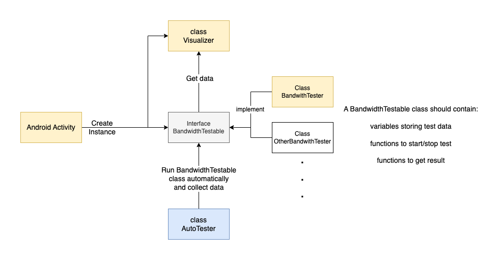
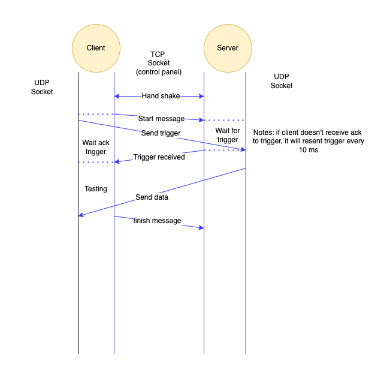

# 设计文档
## 测网速接口设计

## 网速测试通信流程

* 因为NAT转化的存在，只能由客户端发送给服务端udp datagram再由服务端解析出客户端ip和端口。
* 客户端发送的udp datagram有概率丢失，会导致测试无法进行。
* tcp连接作为控制面承担更多功能，负责告知客户端是否已经知道udp的ip和端口。客户端收到消息后再开始接收数据。
* 客户端的finish message中携带测试结果数据。